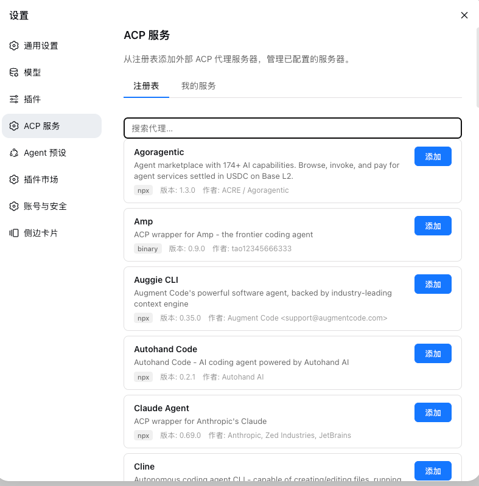
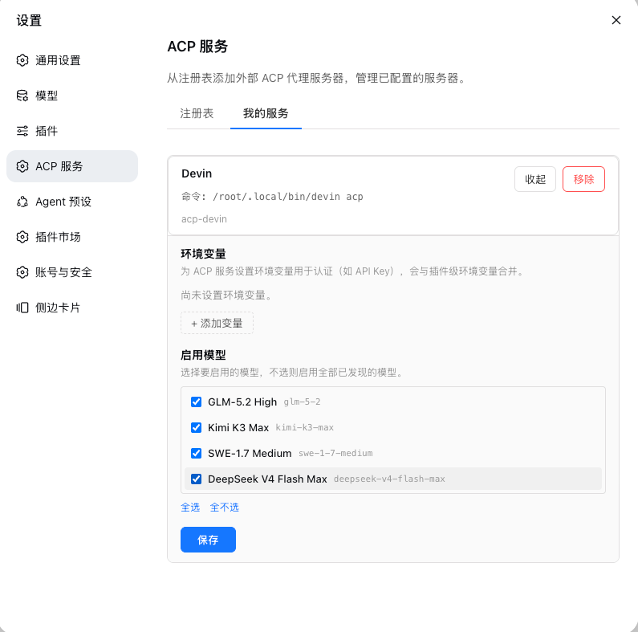
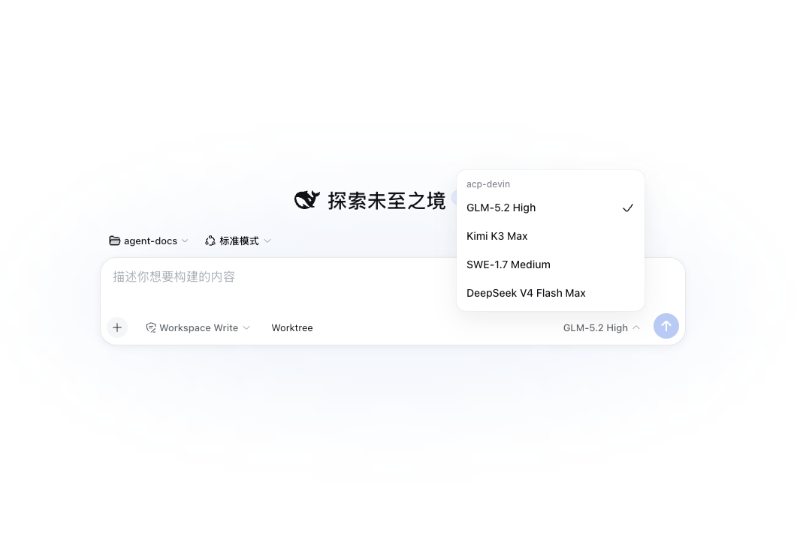

# @deepseek-ai/dsh-llm-acp

中文 | [English](README.en.md)

[DeepSeek Harness](https://github.com/deepseek-ai/deepseek-harness) 的 ACP 客户端 LLM 适配器 + ACP 服务设置界面。通过外部 [Agent Client Protocol](https://agentclientprotocol.com) 服务器作为模型提供方接入 harness 的 LLM 层，并提供一个 Web 设置页面用于浏览 ACP 注册表和管理已配置的服务器。

本包是一个**双面 dsh 插件**：宿主端（`lib/index.js`）是传输适配器，在 `ctx.llm` 上注册 provider 路由；客户端（`lib/client.js`）是浏览器设置页面，让用户从 Web UI 浏览 ACP 注册表并添加/删除 ACP agent 服务器。

## 界面
### ACP注册表添加acp-server
支持acp registry上的所有acp-server[https://agentclientprotocol.com/get-started/registry]

如claude,codex,opencode等


### ACP服务管理


### 使用acp-server进行交互


## 安装

```sh
dsh plugin --profile my-acp add github:shenkonghui/dsh-llm-acp
```

或从本地目录安装：

```sh
dsh plugin --profile my-acp add ./dsh-llm-acp
```

构建产物（`lib/`）已提交到仓库，安装时无需运行任何构建脚本。

## 卸载

```sh
dsh plugin --profile my-acp remove @deepseek-ai/dsh-llm-acp
```

这会从 profile 中移除依赖和 bundle 层。

## 配置

安装后，在 Web UI 中打开 **设置 → ACP 服务**。浏览 ACP 注册表，在任意 agent（如 Devin、Codex、Claude Agent）上点击 **添加**，即可将其配置为 ACP 服务器。每个已配置的服务器会创建一个独立的 provider 路由 `acp-<server-id>`。

在 **我的服务** 标签页中，点击任意已配置服务器上的 **编辑** 按钮，可以：
- 设置**环境变量**用于认证（如 `DEEPSEEK_API_KEY`、`OPENAI_API_KEY`）。每个服务器的环境变量会与插件级 `env` 合并，服务级优先。
- 选择要**启用的模型**。从服务器发现的模型目录中多选要暴露的模型，不选则启用全部已发现的模型。

ACP server 不单独保存权限策略。它复用会话输入框中的权限列表：`read-only` 和 `workspace-write` 将敏感操作转发到 harness 审批界面，`danger-full-access` 自动允许。

也可以直接在 `settings.yaml` 中配置：

```yaml
llm-acp:
  servers:
    devin:
      command: devin
      args:
        - acp
      name: Devin
      env:
        DEEPSEEK_API_KEY: sk-xxx
      models:
        - deepseek-chat
        - deepseek-reasoner
```

## 工作原理

### 整体流程

**1. 插件加载阶段（`apply()`，`src/index.ts`）**

```
dsh harness 启动
  └─ apply(ctx, config)
       ├─ 读取 llm-acp 设置命名空间 + 内联 config.servers，合并成服务器列表
       ├─ 对每个服务器 createServer()：
       │    ├─ resolveNpxShortcut()：npx -y <pkg> 若 bin 已在 PATH 则直接用 bin
       │    ├─ new AcpConnection()：spawn 长生命周期子进程（stdin/stdout JSON-RPC）
       │    │    └─ initialize() 握手 → 仅配置了 API key 时才 authenticate()
       │    │       （无 key 直接走 env/缓存登录；session/new 失败才惰性补一次 authenticate；
       │    │         广告多种方式且未选 authMethod 时不猜、不起轮，交给 UI 选择）
       │    ├─ new AcpAdapter()：构造时 discoverModels() 探测模型目录
       │    └─ ctx.llm.registerAdapter(['acp-<server-id>'], adapter)
       └─ reconcileDirectory()：向设置页注册可配置 provider 目录
```

**2. 模型调用阶段（每次 `stream()`，`src/adapter.ts`）**

```
harness 请求模型
  └─ AcpAdapter.stream(options)
       ├─ await connection.ready（等 ACP initialize 完成）
       ├─ Session 决策：
       │    ├─ 有 dsh sessionId 且已有复用映射（历史未变短）
       │    │    → 复用同一 ACP session，只发增量用户消息（renderPromptDelta）
       │    └─ 否则 session/new 新建，全量历史渲染成一条文本块（renderPrompt）
       │      （历史变短即 compaction，也走新建）
       ├─ setSessionModel()：best-effort 设置所选模型
       ├─ session/prompt 流式循环：
       │    ├─ agent_message_chunk  → text-delta chunk
       │    ├─ agent_thought_chunk  → reasoning-delta（emitReasoning 开启时）
       │    ├─ 扩展进度通知          → reasoning-delta
       │    ├─ usage_update         → usage chunk（上下文字数占用）
       │    └─ stopReason 终态      → finish chunk（end_turn→stop 等）
       └─ 收尾：复用 session 记入 sessionMap 供下轮复用；一次性 session 关闭
```

权限请求（`session/request_permission`）按当前会话的权限预设路由：`danger-full-access` 自动 allow，否则弹 harness 的 approval UI。

**3. 设置界面阶段（浏览器端，`src/client/`）**

```
Web UI「设置 → ACP 服务」
  ├─ 浏览内置 ACP 注册表（registry.json）→ 点「添加」写入 llm-acp.servers
  ├─ 宿主端监听 settings 变更 → reconcileServers() 增删/重建连接（指纹比对）
  ├─ 模型发现：registerModelDiscovery 路由 acp-<id> → 临时 session/new 读 configOptions
  ├─ acp-info-<id>：只读 initialize 身份（agent 名/版本），不建 session
  └─ acp-resolve-<bin>：探测 PATH，把 npx 形式改存本地 bin 路径
```

核心设计：**每个 ACP 服务器 = 一个常驻子进程 = 一个 provider 路由 `acp-<id>`**；工具由 ACP 服务器内部自己执行，适配器只透传文本/推理流，不接 harness 工具生态。

### 宿主端 — LLM 适配器

`apply(ctx, config)` 从 `llm-acp` 设置命名空间读取已配置的服务器列表。对每个服务器，启动一个长生命周期的子进程，通过 stdin/stdout 建立 ACP `ClientSideConnection`，并在 `ctx.llm` 上注册路由为 `acp-<server-id>` 的 `AcpAdapter`。每次模型调用会创建新的 ACP session，将完整对话作为一条用户消息发送，并将流式 `agent_message_chunk` 更新转换为 harness 的 `StreamChunk`。

### 客户端 — 设置界面

浏览器端注册一个 `settings.section` slot，渲染 ACP 注册表浏览器和"我的服务"列表。添加服务器时会将其持久化到 `llm-acp` 设置命名空间；宿主端监听变更并同步更新 provider 目录。

### 注册表命令推导

ACP 注册表指定了不同的分发类型：

| 类型 | 命令 |
|---|---|
| `npx` | `npx -y <package> ...args` |
| `uvx` | `uvx <package> ...args` |
| `binary` | 取注册表 `cmd` 的 basename（如 `./bin/devin` → `devin`） |

binary 类型使用可执行文件的 basename，这样已安装到 PATH 的二进制文件可以直接找到，避免 `spawn ./bin/devin ENOENT` 错误。

## 配置项

| 配置 | 默认值 | 说明 |
|---|---|---|
| `emitReasoning` | `true` | 是否将 `agent_thought_chunk` 转换为 `reasoning-delta` chunk。 |
| `emitToolCalls` | `true` | 会话内 ACP 工具调用固定落为 `tool/call`/`tool/result` 会话事件（工具卡片）；无会话上下文时（如设置页探测）才退化为 `[tool: <title>]` reasoning 文本。此项只控制这段回退文本，不影响任何执行与记录。 |
| `emitProgress` | `false` | 是否把扩展进度通知（如 `_cognition.ai/output` 的 MCP 连接日志）呈现为 reasoning 文本。与服务端噪声相关，故默认关闭。 |
| `defaultModelId` | `devin` | ACP 发现未返回模型时的回退模型 ID。 |
| `defaultModelName` | `Devin (ACP)` | 回退模型显示名称。 |
| `disposeEofGraceMs` | `6000` | stdin EOF 后等待平台终止的宽限时间（毫秒）。 |
| `disposeGraceMs` | `3000` | SIGTERM 后等待 SIGKILL 的 POSIX 宽限时间（毫秒）。 |
| `initTimeoutMs` | `120000` | `initialize` 握手（含 keyed `authenticate`）的上限（毫秒）。 |
| `sessionTimeoutMs` | `60000` | `session/new`、`session/list`、`session/set_config_option` 的上限（毫秒）。 |
| `authTimeoutMs` | `15000` | 单次 `authenticate` 调用的上限（毫秒）。 |

## 协议契约

每次 `stream()` 调用：

1. **Session 获取**：请求携带 dsh `sessionId` 且已有复用映射（历史未变短）时，复用同一 ACP session；否则创建新的 ACP `session/new`，`cwd` 取调用会话的工作目录（无会话上下文时用连接的启动 `cwd`）。历史变短（compaction）也走新建。
2. **消息发送**：复用 session 时仅发送增量用户消息（跳过已发送的历史和 assistant 响应）；新建 session 时将 harness 的 `messages` 和 `system` prompt 渲染为一条 ACP 文本块。
3. 发送 `session/prompt`，将流式 `agent_message_chunk` 更新作为 `text-delta` chunk 传输。
4. 当 `emitReasoning` 开启时，`agent_thought_chunk` 更新转换为 `reasoning-delta` chunk。
5. `usage_update` 通知转换为 `usage` chunk（`inputTokens` 为服务器上报的上下文字数），同时把它的 `size` 记为该路由的 `context.contextWindow`。
6. `session/prompt` 响应的终态 `stopReason` 转换为 `finish` chunk。

`usage` chunk 只对会话主线请求输出；compaction / session-title 这类辅助调用渲染的是自己的临时 prompt，其占用会顶掉真实样本，因此不上报。

工具调用**不作为 tool-call 块输出**。这不是省事，而是必须：`agent-loop/src/agent.ts` 会把 assistant message 里的 `tool-call` 块交给 `executeToolCalls` 真正执行，而 ACP 服务器的工具已在它自己的进程里跑完，再发一遍会让 harness 拿自己的工具注册表重复执行或报 unknown tool。因此 ACP 的 `tool_call`/`tool_call_update` 通知被直接落成会话事件 `tool/call` + `tool/result`（与 `executeToolCalls` 写入的同一对事件，按当前打开的 `step/start` 标记 turn/step），会话 UI 据此渲染工具调用卡片；`tool/result` 以 `sourceEventSeqs` 引用其 `tool/call`，`failed` 状态生成 `isError` 的 error 结果，prompt 结束仍未收尾的调用会补一条空结果，不让日志留下悬空调用。卡片行族按 ACP 的 `tool_call.kind` 映射到原生工具名（`read`→`read`、`edit`→`edit`、`execute`→`bash`、`search`→`grep`、`fetch`→`web_fetch`），以复用原生的图标、本地化标题和可点击文件路径；没有原生等价的 kind（或服务器未给 kind）保留服务器 title，落通用卡片。无 `rawInput` 的调用 `arguments` 记为 `{}`，避免卡片摘要退化为 callId。没有会话上下文时（模型发现、设置页探测）回退为 `[tool: <title>]` reasoning 活动提示（由 `emitToolCalls` 控制），不参与 harness 的工具生态。ACP 服务器内部执行自己的工具。`session/request_permission` 复用当前会话的权限预设：`danger-full-access` 自动允许，其他预设通过 harness 一次性审批请求处理；审批不可用、失败或 ACP 未提供 `allow_once` 时拒绝执行。

一个已知的卡片顺序差异：ACP 工具调用发生在模型流期间，其会话事件的 seq 小于流结束后才落盘的 assistant message，而会话 UI 按 seq 排序，因此落定/重放视图中该步的工具卡片显示在该步文本上方——原生 dsh 中工具在消息落盘后才执行，卡片恒在文本下方；流式切换到落定视图时卡片会有一次自下而上的视觉重排。这是会话事件 seq 单调分配的固有结果，插件侧无法调整，接受现状。

### 协议调试转储

设置环境变量 `DSH_LLM_ACP_DEBUG_DIR=<目录>` 后，每条连接会把自身全部 ACP 交互以 JSONL 追加写入该目录下的 `acp-<命令名>-<时间戳>-<pid>.jsonl`，用于离线排查流量与延迟（例如 `session/prompt` 的实际负载、`session/update-dropped` 的来源）。每行一条事件，携带各自的到达时间与未截断的 detail，不做内存缓冲那样的折叠；文件在首个事件到达时才创建，目录不存在时自动建立。写入失败只告警一次并关闭转储，不影响连接。未设置该变量时不产生任何文件。

### 停止原因映射

| ACP | Harness finish |
|---|---|
| `end_turn` | `stop` |
| `max_tokens` | `max-tokens` |
| `refusal` | `error`（code `REFUSAL`） |
| `cancelled` | `aborted` |
| `max_turn_requests` / 未知 | `error` |

## 构建

```sh
pnpm install
pnpm build    # tsc -b && tsdown
```

构建产物已提交到仓库，用户安装时只需 `pnpm install` 即可。

## 已知限制与待办事项

- **不支持 harness 工具生态** — ACP 服务器执行自己的工具；harness 的 `GenerateOptions.tools` 被忽略。
- **上下文用量只报占用、不报输出** — ACP 的 `usage_update` 只给出「当前上下文字数」(`used`) 与「上下文窗口」(`size`)，没有本轮回输出的 token 数；适配器据此输出 `usage` chunk（`inputTokens = used`、`outputTokens = 0`）并在 `resolveModel` 上广告 `context.contextWindow`，因此输入框旁的上下文占用环会亮起，而累计输出 token 统计恒为 0。该占用描述的是 **ACP 服务器自己的上下文**（它自己的系统提示、工具集与收到的对话），不是 harness 侧的 prompt 投影。窗口的回退规则：

  - 服务器尚未上报样本时不广告容量 —— 首个请求的占用环不渲染（harness 也不会凭空造出 0%），样本到达后的下一个请求才补上；
  - `session/new` 阶段就上报的样本同样生效，即使该 session（如模型发现用的探测 session）没有 prompt 在消费它；
  - 后续样本给出无效窗口（非正整数）时保留上一个已知值，不把已经亮起的占用环打灭；
  - 给出新的有效窗口时替换 —— 切到窗口更大的模型会立即反映；
  - 切换到另一条尚未上报的 provider 路由时，harness 会清掉旧容量，而不是复用上一个 server 的窗口。
- **系统提示在消息体内** — ACP `session/new` 没有 system 槽位，harness 的 system prompt 被拼接到用户消息文本前。
- **新建 session 才全量渲染** — 仅在无复用映射（首轮、一次性调用）或历史变短（compaction）时，适配器将整个 `messages` 数组渲染为一条用户消息；复用轮次只发增量用户消息。
- **ACP v1（SDK 0.25.1）** — 适配器使用 `@agentclientprotocol/sdk` 0.25.1，其 `session/prompt` 响应携带终态 `stopReason`（v1 契约）。
- **扩展协议处理** — Devin 的 `_cognition.ai/*` 通知被静默消费（进度文本在 `emitReasoning` 开启时作为 reasoning 输出）；其他非标准 ACP 扩展被吞掉以避免 SDK 错误日志。
- **认证惰性化** — 未配置 API key 时不主动调用 `authenticate`：依赖 env 凭证或 CLI 缓存登录的 server 直接 `session/new` 成功；仅当 `session/new` 失败才执行一次有界（`authTimeoutMs`）的 `authenticate` 并重试。交互式浏览器登录只在确实需要时触发，URL 同时经警告日志与设置页 `acp-auth-<id>` 路由暴露。
- **多登录方式需选择，不猜** — 服务器广告多种认证方式时（如 codebuddy 的 `iOA`(仅内网可达) / `external` / `internal` / `selfhosted`），插件不再默认取第一个：未选择就不发起 `authenticate`，改为快速失败并在会话下方弹出选择框（`acp-methods-<id>` 路由提供方法目录），选择写入 `servers.<id>.authMethod` 并在「设置 → ACP 服务」里可随时更改。**只有一种方式时自动使用，无需选择**；配置了未被广告的 id 且存在多种方式时同样视为未选择（不回退到第一个）。选择变更会重建该 server 的连接——这既应用了新方式，也顺带丢弃仍挂在上一个方式上的 `authenticate` 轮。带 API key 的预认证轮走同一套解析，因此 key 不再会让插件替你选中第一个方式。
- **子代理活动可识别、可按权限映射呈现，但不能拦截** — 服务器在自己的进程里派生子代理，harness 没有介入点（ACP 是 server-initiated，适配器也不透传工具的输入输出）。能做的是识别并告知：识别依据是工具调用的 `_meta`，不是可读标题——

  | 结构 | 位置 | 值 |
  |---|---|---|
  | 子代理创建 | `tool_call._meta["cognition.ai/inferenceToolName"]` | `run_subagent` |
  | 子代理档位 / 短标签 | 该调用的 `rawInput` | `profile` / `title`（`kind` 为空，不能用作判据） |
  | 子代理内部的调用 | 这些调用的 `_meta["cognition.ai/subagent_context"]` | `parentAgentId` |
  | 子代理自身结束 | 一个**没有对应 `tool_call`** 的 `tool_call_update`，其 `toolCallId` 就是上一步的 `parentAgentId` | `status: completed` |

  是否呈现由 `servers.<id>.subagentMap` 决定（dsh 权限预设名或 sandbox 模式 → `notice` / `silent`，默认 `notice`）：需要审批的会话被告知发生了扇出，全权委托的会话保持安静。子代理按独立 session 计费、有自己的上下文窗口，这是唯一值得提示的理由。注意它只是**提示**（走 reasoning 通道，由 `subagentMap` 单独控制），不构成审批，也无法阻止服务器继续派生子代理。

## 许可证

MIT
